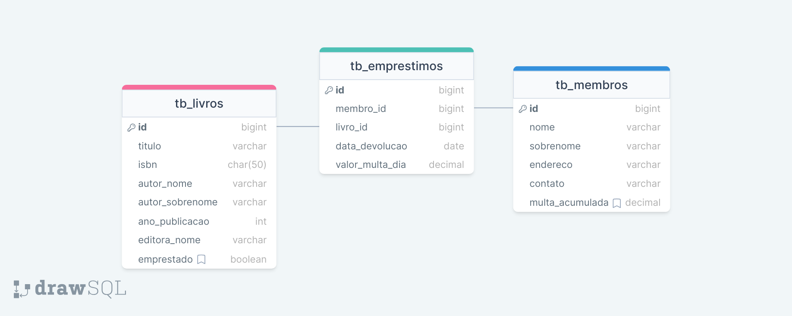

# Projeto: SISTEMA DE BIBLIOTECA  (java-sistemabibliotecas)

Projeto disciplina Programação Web II com o fim de implementar um sistema de bibliotecas numa arquitetura REST usando Spring Boot e persistência H2/PostgreSQL.

- Programa: [Ada](https://ada.tech/) Ser + Tech Programa 50+ (Turma #1076)
- Curso: Programação Web II
- Prof.:  Alex Facincani (https://github.com/facincani)
- Exercício: implementar CRUD em API REST


## DESCRIÇÃO DO PROJETO:
```
Sistema de biblioteca:
Gestão de Livros
Must have
Criar, visualizar, atualizar e deletar (CRUD) livros.
Informações de um livro podem incluir mas não se limitam à: título, autor, ano de publicação, ISBN... 

Gestão de Membros
Criar, visualizar, atualizar e deletar (CRUD) membros.
Informações de um membro podem incluir mas não se limitam à nome, endereço, contato...

Nice to have
Gestão de Empréstimos
Registrar empréstimos de livros aos membros.
Definir prazo para devolução e gerenciar multas por atraso.

Considere apenas relacionamentos 1:1
```

# PROJETO SISTEMA PARA BIBLIOTECAS

Este é um projeto que tem a finalidade de usar a linguagem Java para implementar um serviço RESTful de controle para um sistema de bibliotecas. Entidades básicas: livros, membros e empréstimos. A interface de acesso será via métodos HTTP acessando endpoints e provendo operações [CRUD](https://en.wikipedia.org/wiki/Create,_read,_update_and_delete) (operações de Create, Read, Update e Delete). Originalmente, operações CRUD foram relacionadas com persistência de dados e há comandos SQL para cada operação. Em arquitetura de APIs RESTfull, métodos HTTP são usados com este objetivo.

### Disclaimer
*As informações neste Readme.md contém informações sobre o projeto (construção e execução) mas também apresenta informações com o fim de documentar questões, problemas e algumas soluções que surgiram durante o desenvolvimento e aperfeiçoamento.*


## Frameworks de suporte

[Spring Boot](https://spring.io/projects/spring-boot)
Plataforma para criar aplicações autocontidas (servidor de aplicações Tomcat/Jetty/Undertow incluído e configurado) e no qual o Spring configura dependências e inicializa os respectivos objetos através do padrão de Injeção de Dependências (DI - *Dependency Injection*).

### Persistência de dados

[Spring Data (JPA)](https://spring.io/projects/spring-data) Framework Spring para persistência. Através de anotações permite usar o framework do Hibernate para persistir dados em Banco de Dados (relacional).

[H2](https://h2database.com) Banco de Dados relacional de código aberto (open source) em memória (ou em arquivo) que facilita o processo de arquitetura de uma aplicação para fins de teste.

[PostgreSQL](https://www.postgresql.org/) Banco de Dados relacional de código aberto (open source) para projetos que aliam performance, robustez e confiança. Deve ser instalado localmente, mas pode ser usado em imagens Docker.


### Outros recursos
A arquitetura API RESTful apresentada em aula será base para este projeto de sistema para bibliotecas. O que deverá ser implementado/incorporado:
- Resolução completa do exercício
- Docker para implantação do banco de dados PostgreSQL
- [Docker Swarm](https://docs.docker.com/engine/swarm/) para implementar de forma segura os valores de segredos (principalmente senhas).
- [Jasypt](http://www.jasypt.org/) Recurso para cifrar/decifrar dados sensíveis em arquivos de recursos do projeto. Implementação mais recente com integração Spring devido a [Ulises Bocchio](https://github.com/ulisesbocchio/jasypt-spring-boot).
- Autenticação para acesso a áreas da aplicação (***esperança***).
- Testes unitários (***esperança***).

# Configurações do projeto

### Tags
- ~~`v0.3` Modelo definido com as classes; persistência em memória (H2); endpoints para Livro e Membro para consulta via GET (todos os dados)~~
- TODO: `v0.4` Endpoints para consulta (GET) por Id de Livro e Membro
- TODO: `v0.5` Endpoints para inclusão (POST) de Livro e Membro
- TODO: `v0.6` Endpoints para remoção (DELETE) de Livro e Membro com base em Id
- TODO: `v0.7` Endpoints para atualização (PUT) de Livro e Membro com base em Id
- TODO: `v0.8` Endpoints para incluir empréstimo (POST) de Livro para um Membro
- TODO: `v0.9` Endpoints para devolução de Livro e remoção de Empréstimo (DELETE) e cálculo de multa
- TODO: `v1.0` Finalização do projeto básico.

- Estão definidas no arquivo de propriedades `application.properties` localizado em `src\main\resources`.
- Tanto para a configuração de banco de dados H2 quanto para PostgreSQL, o nome da base será `biblioteca`.
- Serão incluídas configurações tanto para BD H2 quanto para PostgreSQL, sendo que será usado o H2 num primeiro momento para testes. 

### Container Tomcat
Porta local do container: 8082 (para não conflitar com porta 8080, padrão Tomcat)
```properties
server.port=8082
```

### Persistência: Conectividade e configuração H2

Através de URL: jdbc:postgresql://localhost:8432/biblioteca

Então, como configuração de banco de dados, tem-se:
- Porta do servidor exposta: **8432**
- Nome da base de dados: **todolist**
- Nome de usuário para gerenciar essa base de dados: **uforadaprog** (atributos: Create DB)
- Senha do usuário uforadaprog: definida durante criação do usuário (visto a seguir)
- Senha do usuário `postgres`, administrador do banco de dados foi definida em um arquivo que será lido pelo PostgreSQL durante inicialização (criação da instância).
- Nome das tabelas: **tarefas** e **usuarios**
  Configuração parcial arquivo Dockerfile (`docker-compose-for-postgres.yml`)


# Persistencia em BD H2
spring.datasource.url=jdbc:h2:mem:todolistdb
spring.datasource.driverClassName=org.h2.Driver

###### Configurando com JSASYPT para cifragem de informacoes
spring.datasource.username=ENC(gzdxhRpD3mqslnWK8n0IArjIJl6GQs56a7FSv75A5rzTlFoLi37qnU1bwJmlqipT)
spring.datasource.password=ENC(dKFf9nGYtB2UxhoHtuqzbjXraFRoSBChG0PxccQa/2NSdxsBjAbrtBQ9WcR1oW9e)
spring.jpa.database-platform=org.hibernate.dialect.H2Dialect
spring.h2.console.enabled=true
spring.h2.console.path=/h2-console
spring.h2.console.settings.trace=false
spring.h2.console.settings.web-allow-others=false

# Base de dados sempre ser� REECRIADA a cada reinicializacao
spring.jpa.hibernate.ddl-auto=create

# Persistencia em BD PostgreSQL
#DATASOURCE POSTGRES
#spring.datasource.driver-class-name=org.postgresql.Driver
#spring.jpa.properties.hibernate.dialect=org.hibernate.dialect.PostgreSQLDialect
#spring.jpa.show-sql=true
#spring.jpa.database=POSTGRESQL
# Base de dados sempre ser� criada
#spring.jpa.hibernate.ddl-auto=update
#spring.sql.init.mode=always

# Para uso com DOCKER
# spring.datasource.url=${SPRING_DATASOURCE_URL:jdbc:postgresql://localhost:8432/todolist}
# spring.datasource.username=${SPRING_DATASOURCE_USERNAME:uforadaprog}
# spring.datasource.password=${SPRING_DATASOURCE_PASSWORD:"adatech BD PROG-WEB"}

# Para uso de PostgreSQL instalado localmente
#spring.datasource.url=jdbc:postgresql://localhost:5432/postgres
#spring.datasource.username=postgres
#spring.datasource.password=postgres

# spring.jpa.hibernate.ddl-auto=${SPRING_JPA_HIBERNATE_DDL_AUTO:update}


# Modelagem do projeto de Sistema de Bibliotecas

A imagem da figura a seguir apresenta o diagrama Entidade-Relacionamento relativos à persistência dos dados que são criados e geridos pela aplicação.

## Diagrama de classes básico do projeto


Algumas considerações sobre as estruturas de dados:
- Considerando a restrição de relacionamentos 1:1, cada livro só terá um autor e cada usuário só pode emprestar um único livro.
- Tabela **Membros** (`tb_membros`): o campo endereco é composto e irá conter todos os dados relativos a endereço (logradouro, número, complemento, CEP, cidade, estado, país); objetivo: diminuir complexidade. O campo contato pode conter telefone ou email, logo, VARCHAR (255). Há um campo contendo o valor da multa acumulada de empréstimos de livros entregues em atraso (`multa_acumulada`). A aplicação deverá prover um endpoint (função/método) para pagamento da mesma e para zerar o respectivo valor. * Em princípio, esta funcionalidade não será incluída neste projeto*.
- Tabela **Livros** (`tb_livros`): há os campos descritivos do objeto do empréstimo acrescido do campo de `emprestado` que é Boolean e será setado em **True** para livro emprestado (o registro de um livro terá este campo inicializado em **False**).
- Tabela **Emprestimos** (`tb_emprestimos`): Cada empréstimo associa um membro (`membro_id`) com um livro (`livro_id`). Ao realizar o empréstimo, deve ser especificada a data de devolução (`data_devolucao`) e o valor da multa por dia. O usuário membro saberá na data de empréstimo quanto será a multa devida por dia de atraso. Aqui, esse dado por vir de uma tabela que associa tipos de materiais com valores de multa (o modelo requer, neste caso, um campo de tipo de livro/material). Essa parte da modelagem não foi incluída visando minimizar complexidade.

# Configuração básicas das classes e respectivas anotações Spring

Estrutura em pacotes para acomodar as respectivas classes que definem a estrutura básica de separação de responsabilidades:
```
src/main/java/tech.ada
package tech.ada.sistemabiblioteca.model;
package tech.ada.sistemabiblioteca.controller;
package tech.ada.sistemabiblioteca.service;
package tech.ada.sistemabiblioteca.repository;
```
Será usado o ***Maven*** para gerenciar dependências entre bibliotecas e componentes do projeto e o ***Spring*** para as dependências entre as classes e os objetos. O arquivo de configuração do Maven é o `pom.xml` e fica no diretório raiz do projeto.
```text
pom.xml (Project Object Model)
  <groupId>br.ada.tech</groupId>  Indica organização
  <artifactId>h2</artifactId>   Faz referência ao projeto em si
```
Obs: os comandos que invocam `mvn` em linha de comando devem ser executados a partir da raiz do projeto no qual esteja o arquivo pom.xml.

Arquitetura MVC (Model-View-Controller) que consiste nas camadas de apresentação, domínio e fonte de dados.

- `Controller` (anotação Spring `@Controller`) gerência da interface entre o usuário e a lógica da aplicação (Service); exposição da funcionalidade (no caso, APIs REST)
- `Service` (anotação Spring `@Service`) implementação da ***lógica de negócio*** (lógica do domínio do negócio)
- `Repository` (anotação Spring `@Repository`) gerência do armazenamento; ***persistência*** dos dados em um sistema de memória

Todas as três anotações são derivadas de `@Component`. Esta anotação e derivadas indicam ao Spring para que gerencie uma determinada classe.

A anotação `@Autowired` do Spring define atributos que são gerenciados automaticamente (objetos e dependências instanciados e destruídos). Ela define a ***injeção de dependência*** de uma classe em outra classe.


Referência para o [Spring Boot](https://docs.spring.io/spring-boot/docs/current/reference/html/getting-started.html):

Pacote base: package tech.ada.biblioteca;

Classe principal (base) do projeto anotada com `@SpringBootApplication`: meta-anotação que combina `@SpringBootConfiguration`, `@EnableAutoConfiguration` e `@ComponentScan`. Elas tratam da configuração automática, suporte a propriedades e gerenciamento das dependências (varredura de componentes no diretório do projeto) para prover um ambiente de execução das aplicações.


Para serviços REST, o [Spring MVC](https://www.baeldung.com/spring-mvc-tutorial) (Model-View-Controller) fornece anotações `@RestController` e `@RequestMapping`. A @RestController é anotação tipo *stereotype* que: facilita leitura e indica o que uma classe deve fazer (neste caso, tratar requisições Web). A @RequestMapping é base para todas as especializações de requisições HTTP. Exemplo: @PostMapping é equivalente a @RequestMapping(method=POST). @RestController é uma especialização e inclui as anotações `@Controller` e `@ResponseBody`.

# Modelo e Persistência

## Classes
Foram criadas as três classes no sistema: `Livro`, `Membro` e `Emprestimo`. Observações:
- Todas foram anotadas com `@Entity` para indicar que são gerenciadas e persistidas pelo Hibernate.
- Criados métodos Getters e Setters de forma manual. Poder ser usada a biblioteca ***Lombok*** através de anotações `@Getter` e `@Setter` que geram automaticamente os métodos durante a fase de compilação, evitando que sejam definidos manualmente.
- Para o valor da multa acumulada no objeto Membro: a) tipo BigDecimal (Java possui classe Currency para representar moedas seguindo the ISO 4217); b) foi inicializado com zero no método setter.
- Para o valor da multa por dia no objeto Emprestimo: deve ser ajustada durante a instanciação e definida conforme uma tabela.


## Persistência

Inclusão da dependência Spring para tratar a persistência dos objetos em bases de dados relacionais (H2 ou PostgreSQL, neste projeto).

Dependência: `Spring Boot Starter Data JPA` (Starter for using Spring Data ***JPA*** with ***Hibernate***): fornece anotação `@Entity` para definir quais classes serão persistidas em BD usando a JPA (Java Persistence API). O framework ***Hibernate*** implementa a JPA e é definido como um ORM (Object Relationl Mapping). O acesso aos banco de dados é feito por meio da API JDBC (Java Database Connectivity) que é de nível mais básico.

<!-- https://mvnrepository.com/artifact/org.springframework.boot/spring-boot-starter-data-jpa -->
<dependency>
    <groupId>org.springframework.boot</groupId>
    <artifactId>spring-boot-starter-data-jpa</artifactId>
    <version>3.2.3</version>
</dependency>

Observações:
- Questão do nome dos atributos de classe e do nome da coluna. Como SQL é case-insensitive, nomes são vertidos de forma automática pelo JPA. Para controlar os nomes das tabelas e das colunas (campos) no BD, são fornecidas as seguintes anotações: `@Table` e `@Column`. Segue exemplo da aplicação na classe Livro.
- A JPA é fornecida pela biblioteca `jakarta.persistence` que deve ser importada nos arquivos de classe. Referência: [Jakarta Persistence](https://jakarta.ee/specifications/persistence/3.0/jakarta-persistence-spec-3.0.html)
- JPA também define anotações para especificar e definir uma coluna como chave primária, no caso, o campo de `id` (`@Id`), e também como serão gerados os valores, através de `@GeneratedValues`. Formas: AUTO (padrão), IDENTITY, SEQUENCE e TABLE.
- Deve ser fornecido um *construtor sem argumentos* (public Livro() {}) ou, se não especificado, será usado o padrão (vazio). Caso seja incluído um construtor parametrizado, então é obrigatório a inclusão do construtor vazio (sem argumentos).
- Recurso para identificar o relationamento de tipos entre Java e Banco de Dados: [Hibernate ORM User Guide](https://docs.jboss.org/hibernate/orm/6.2/userguide/html_single/Hibernate_User_Guide.html)
- Alguns mapeamentos: Java:LocalDate -> PSQL:DATE; Java:BigDecimal -> PSQL:NUMERIC ou DECIMAL
- Em PostgreSQL pode especificar moedas usando o tipo `money` ou os [tipos numéricos](https://www.postgresql.org/docs/current/datatype-numeric.html) `numeric` e `decimal` no qual podem ser especificadas a precisão e escala. Exemplo para 4 dígitos significativos e 2 dígitos fracionarios: NUMERICA(4,2).

```java
@Entity
@Table(name = "tb_livros")
public class Livro {
    @Id
    @GeneratedValue(strategy = GenerationType.IDENTITY)
    private Long id;

    private String titulo;
    private String isbn;

    @Column(name = "autor_nome")
    private String autorNome;
```

Outros parâmetros para a anotação de coluna (**nullable** é true por padrão; **insertable** também é true por padrão; length também tem tamanho padrão 255). Parâmetro unique pode especificar um coluna que não tenha valores repetidos, logo, pode compor chave primária.
```java
 @Column(name="editora_nome", nullable=true, insertable = true, length = 255, unique = true)
```
## Propriedades e Configuração da Persistência

Banco de dados possuem configurações de acesso e as principais são:
- Driver JDBC
- Caminho ou URL para a base de dados
- Usuário e senha

No projeto Spring Boot elas ficam no arquivo de propriedades `application.properties` localizado em `src/main/resources`. Algumas opções gerais de configuração JPA/Hibernate:
```properties
# Cria/Recria (create) tabelas a cada execução
# Atualiza (update) a cada execução
spring.jpa.hibernate.ddl-auto=update

# Propriedade que define inicialização por scripts (data.sql e schema.sql). Por padrão, H2 sempre será always. 
spring.sql.init.mode=always

# Propriedade para inicialização base dados antes de iniciado o Hibernate. Necessário, senão gera ERRO.
spring.jpa.defer-datasource-initialization=true
```

Os comandos SQL de criação de tabelas e de inicialização de dados devem estar nos seguintes dois arquivos: `schema.sql` e `data.sql`. Ambos dentro do diretório de recursos: `src/main/resources`.


### Persistência e banco de dados H2

O banco de dados H2 ([https://h2database.com/](https://h2database.com/)) é um BD que opera em memória, mas permite criar persistências em:
- Memória: jdbc:h2:mem:biblioteca (banco de dados biblioteca em memória)
- Arquivo: jdbc:h2:/data/biblioteca (banco de dados biblioteca no diretório /data)

Para tornar disponível o H2 para a aplicação, deve: a) configurar a dependência no Maven (pom.xml); e, b) configurar os parâmetros no arquivo de propriedades.
```xml
<!-- https://mvnrepository.com/artifact/com.h2database/h2 -->
<dependency>
  <groupId>com.h2database</groupId>
  <artifactId>h2</artifactId>
  <version>2.2.224</version>
  <scope>runtime</scope>
</dependency>
```


## Service

Classes EmprestimoService, LivroService e MembroService que ligam a camada Web (*controller*) com a camada de persistência (*modelo*)

Todas as classes são anotadas `@Service` (anotação disponível pelo Spring: org.springframework.stereotype.Service).


### Classe service para Livro

@Service
public class LivroService {
public Iterable<Livro> getAll() {
}
}


## Controller

As classes neste pacote definem a camada controladora (camada de apresentação no modelo MVC). Serão usadas as unidades básicas na arquitetura [Jakarta EE](https://jakarta.ee/) com a camada de abstração provida pelo Spring Boot.

A plataforma Jakarta EE especifica componentes e anotações que definem o comportamento dentro de um container de aplicação. A principal API é a ***Jakarta Servlet***, mas duas outras também são importantes: ***Filters*** e ***Listeners***. Servlets é o framework básico para Web que trata da interface entre requisições/respostas do protocolo HTTP e objetos Java. Servlets podem ser configurados via: mapeamento em arquivo web.xml (WEB-INF/web.xml - não muito usado) ou por meio de anotações.

Para permitir que uma classe seja definida como controller, ela precisa ser anotada com `@RestController` fornecida pela dependência ***Spring Boot Starter Web***. Segue definição:
```text
Spring Boot Starter Web
Starter for building web, including RESTful, applications using Spring MVC. Uses Tomcat as the default embedded container 
```
E, deve ser incluída a dependência no Maven (pom.xml).
```xml
<!-- https://mvnrepository.com/artifact/org.springframework.boot/spring-boot-starter-web -->
<dependency>
  <groupId>org.springframework.boot</groupId>
  <artifactId>spring-boot-starter-web</artifactId>
  <version>3.2.3</version>
</dependency>
```


Anotações:
- `@Consumes`: tipo de conteúdo (campo content-type da requisição HTTP) consumido pelo método
- `@Produces`: tipo de conteúdo retornado.


Classe que irá tratar as requisições HTTP.

Anotação: @RestController
@RestController (meta-annotation) = @Controller + @ResponseBody
- @Controller, the dispatcher servlet talk to the ViewResolver to resolve the returned String to a view/page
- @Controller: jsp/thymeleaf
- @RequestMapping(value="/accounts", method=RequestMethod.GET,produces="text/html")
  public String accountSummary() {
  // Put data into model and return view name
  return "summary";
  }

- @RestController, dispatcher servlet uses HttpMessageConverters to send back the raw response to the client in a request format - json/xml
- @RequestMapping(value="/orders", method=RequestMethod.GET, produces="application/json")
  @ResponseBody
  public List<Order> getOrders {
  return orderManager.getAllOrders();
  }
